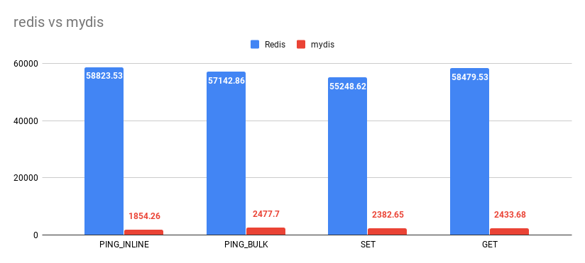

# mydis


[mydis] is remote dictionary server, an in-memory data structure with optional durability. 
Some might say that [mydis][mydis] is a [Redis] clone written in [Scala] on 
top of [Akka][akka-streams], and they would be right.

## The server

```base
Usage: mydis [--interface <string>] [--port <integer>]

Remote dictionary server, an in-memory data structure with optional durability.

Options and flags:
    --help
        Display this help text.
    --interface <string>, -i <string>
        Interface
    --port <integer>, -p <integer>
        Port
```

mydis is distributed as "fatjar" or Docker image. To run one or the other use following commands.

```base
docker run -p 6667:6667 pinkstack/mydis
```

Or use the jar

```base
java -jar ./target/*/mydis.jar -p 6667
```

### Building from source

The easiest way to compile and run mydis is with following command

```base
sbt assembly && java -jar ./target/*/mydis.jar -p 6667
```

It is also very trivial to build Docker image

```base
sbt docker:publishLocal && docker run -p 8080:6667 pinkstack/mydis
```

## Client

Since [mydis] implements RESP protocol, you can use any [Redis client](https://redis.io/clients), or you can
emit raw commands with the help of [netcat] directly via TCP. 

```base
redis-cli -p 6667 ping
redis-cli -p 6667 echo "Hello world\!"
redis-cli -p 6667 set name "Oto Brglez"
redis-cli -p 6667 strlen name
redis-cli -p 6667 get name
redis-cli -p 6667 del name
```

Via [RESP protocol][resp] and [netcat]:
```base
echo -e '*1\r\n$4\r\nPING\r\n' | nc localhost 6667
```

## Supported Redis Commands

- [`SET`](https://redis.io/commands/set) - Set the string value of a key
- [`GET`](https://redis.io/commands/get) - Get the value of a key
- [`DEL`](https://redis.io/commands/del) - Removes the specified keys.
- [`STRLEN`](https://redis.io/commands/strlen) - Get the length of the string value stored at key
- [`EXIST`](https://redis.io/commands/exist) - Determine if key exist
- [`PING`](https://redis.io/commands/ping) - Ping the server
- [`ECHO`](https://redis.io/commands/echo) - Echo the given string
- [`INFO`](https://redis.io/commands/info) - Get information and statistics about the server

## Resources 📚

- [Redis Protocol specification - RESP (`REdis` Serialization Protocol)](https://redis.io/topics/protocol)
- [Redis Commands](https://redis.io/commands)
- [Redis in Action [ebook]](https://redislabs.com/redis-in-action/)
- [The Redis Protocol is pretty great. By Will Larson](https://lethain.com/redis-protocol/)
- [Memcached Protocol](https://github.com/memcached/memcached/blob/master/doc/protocol.txt)
- [Redis Commands - `COMMAND`](https://redis.io/commands/command)
- [Redis Internals documentation](https://redis.io/topics/internals)
- [Akka Streams pitfalls to avoid](https://blog.softwaremill.com/akka-streams-pitfalls-to-avoid-part-2-f93e60746c58)
- [Integrating Akka Streams and Akka Actors: Part II](https://blog.colinbreck.com/integrating-akka-streams-and-akka-actors-part-ii/)
- [(source) sixsigmapymes/akkaLab](https://github.com/sixsigmapymes/akkaLab/blob/master/akka-docs/src/test/scala/docs/stream/operators/flow/FromSinkAndSource.scala)
- [A simple way to write parsers: using the State monad. By Stéphane Derosiaux](https://www.sderosiaux.com/articles/2018/06/15/a-simple-way-to-write-parsers-using-the-state-monad/)

## Benchmarking

Please understand that mydis is highly experimental project and is not meant to be 
used outside of experimental environment. 



```base
redis-benchmark -p 8080 -t set,get,del,ping -n 10000 -c 5 --csv
```

## Author

- [Oto Brglez][otobrglez] 


[Redis]: https://redis.io/
[mydis]: https://github.com/pinkstack/mydis
[otobrglez]: https://github.com/otobrglez
[Scala]: https://www.scala-lang.org/
[netcat]: https://en.wikipedia.org/wiki/Netcat
[resp]: https://redis.io/topics/protocol
[akka-streams]: https://doc.akka.io/docs/akka/current/stream/index.html
